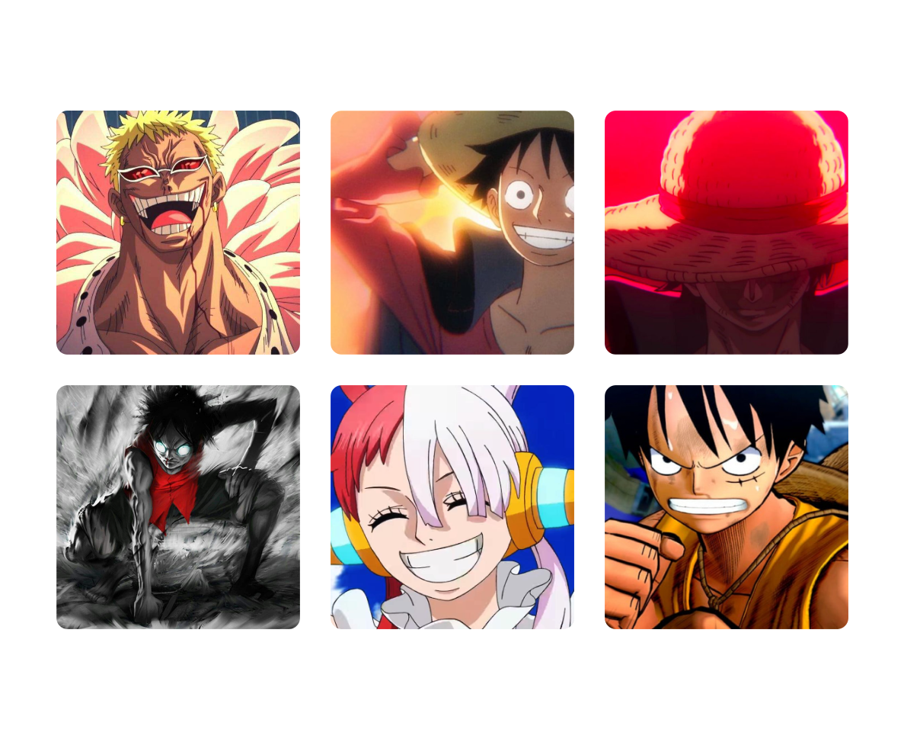
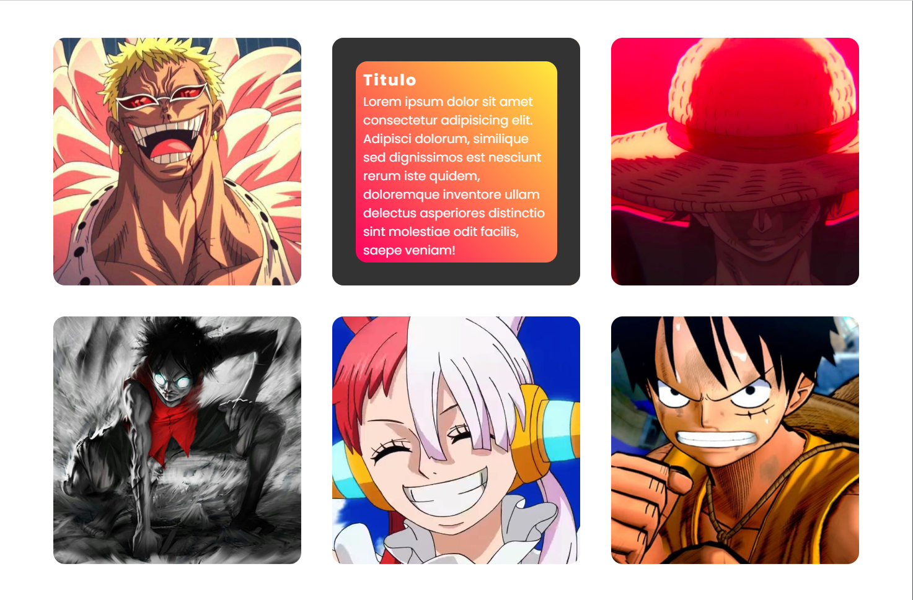

# 3D Cards HTML and CSS

This project is about 3d letters, from the One Piece anime, this project is made with HTML, CSS and Sass
 
# Screen Project  

## Front
<div align="center">

</div>

## Back
<div align="center">

</div>

# Install
```sh
git clone https://github.com/asalinasf/3d-cards/
cd 3d-cards
open in your browse
```

# Visit my project with this url

https://cards3d-aaron.netlify.app/
